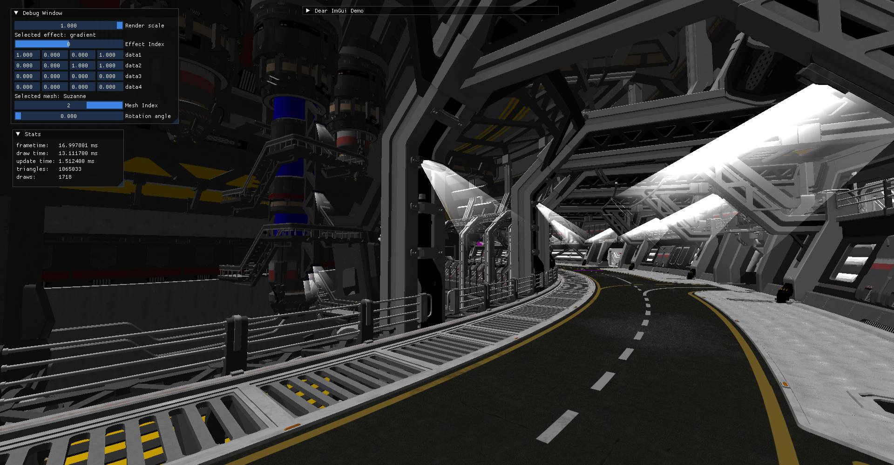

# A Vulkan Engine written in C++!

This engine/renderer served as a learning experience for me to understand how to write a Vulkan engine in C++. It is not intended to be a production-ready engine, but rather a learning tool for exploring the Vulkan API and graphics programming in general. For now, it just has the basic functionality needed to load and render a 3D model.

## Dependencies

- Vulkan SDK
- vkbootstrap
- vma
- SDL3
- glm
- imgui
- stb
- cgltf
- spdlog

## Screenshots

